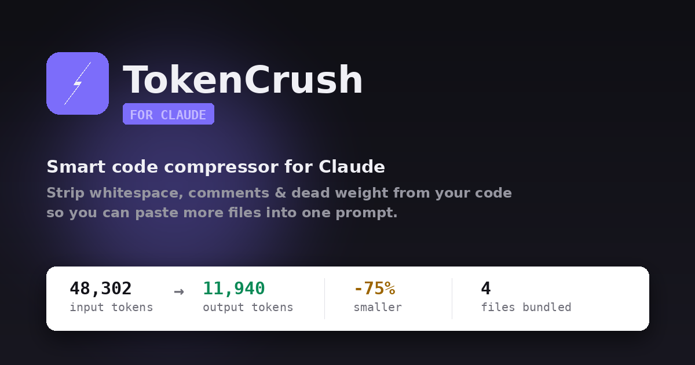

<div align="center">



<br />

# ⚡ TokenCrush

**Smart Code Compressor for Claude — paste more, burn less context.**

[](https://github.com/rhshourav/tc/actions)
[](https://rhshourav.github.io/tc)
[](LICENSE)
[](#)

</div>

---

## What is it?

TokenCrush is a **zero-dependency, browser-only web app** that strips your code down before you paste it into a Claude prompt. Drop in your files, choose a compression strategy, and get back a tighter version — with a live token counter, a diff viewer, and a ready-to-paste prompt bundle.

It runs entirely in the browser. No server. No install. No data leaves your machine. The AI chat feature also runs 100% client-side using a small language model (Qwen2.5 0.5B) via WebAssembly — zero cloud calls.

---

## Features

**Multi-language support** — JS/TS, C/C++, HTML, CSS/SCSS/SASS, Python, JSON, Markdown, and more. Each language gets its own comment stripper, whitespace rules, and reserved word list.

**Modular compression engine** — three independent passes you can mix and match:
- **Strip comments** — language-aware: C-style `//` and `/* */` for JS/C/C++, `#` for Python, `<!-- -->` for HTML
- **Collapse whitespace** — different rules per language (HTML, CSS, C-style, generic)
- **Rename identifiers** — minifies long names to short aliases, with 300+ reserved words per language (JS globals, C/C++ stdlib, Python builtins)

**AI compression modes** — optionally calls `claude-sonnet-4-6` for deeper compression:
- **Pseudo** — compresses and returns a 2-sentence summary
- **Semantic** — rewrites with ternaries, destructuring, and method chaining (100% logical equivalence)
- **Deep** — most aggressive: renames all identifiers, collapses everything, outputs a full identifier map

**AI Chat** — built-in chat panel powered by **Qwen2.5 0.5B Instruct** running entirely in the browser via [Transformers.js](https://github.com/huggingface/transformers.js):
- Ask questions about your code — the active file is automatically included as context
- **Generate README** button creates a markdown README from all loaded files
- Streaming responses with progress indicator
- Model downloads ~300MB on first use, then cached in browser
- Works offline once loaded — zero data leaves your device

**Context map** — whenever identifiers are renamed, a collapsible drawer lists every `originalName → _x` mapping so Claude can still reason about your code.

**Output tabs** — seven views:
- `Compressed` — the raw output
- `Diff` — red/green line-by-line diff
- `Prompt` — ready-to-paste Claude prompt block
- `Bundle` — all files combined
- `History` — session compression history
- `All Stats` — per-file breakdown
- `Chat` — AI assistant (client-side Qwen2.5 0.5B)

**Drag and drop** — drop files, folders, or ZIP archives anywhere on the page. Full-screen overlay with visual feedback. Supports recursive folder reading via `webkitGetAsEntry`.

**Stats bar** — input tokens, output tokens, percentage saved, colour-coded gauge.

**Theme** — light/dark toggle with system-preference detection and `localStorage` persistence.

---

## Getting Started

No build step. Just open `docs/index.html` in a browser — or visit:

**[https://rhshourav.github.io/tc](https://rhshourav.github.io/tc)**

### Using AI mode

AI compression calls the Anthropic API from your browser. You'll need an API key with access to `claude-sonnet-4-6`. The key is never stored.

> AI mode is optional. The local engine alone typically saves 30–60% of tokens.

### Using AI Chat

1. Click the **Chat** tab in the output panel
2. Click **Download Model** (~300MB, first time only — cached after)
3. Select a file from the sidebar to set context
4. Ask questions about your code
5. Use **Generate README** to create markdown documentation from all loaded files

---

## Deployment

### GitHub Pages (default)

Pushes to `main` auto-deploy via `.github/workflows/deploy.yml`.

### Cloudflare Pages

An alternative workflow is provided at `.github/workflows/deploy-cf.yml`. To enable:

1. Create a [Cloudflare Pages](https://pages.cloudflare.com/) project
2. Get your `CLOUDFLARE_API_TOKEN` and `CLOUDFLARE_ACCOUNT_ID`
3. Add them as GitHub repo secrets (Settings → Secrets → Actions)
4. The workflow runs automatically on push to `main`

---

## Repository Layout

```
tc/
├── .github/
│   └── workflows/
│       ├── deploy.yml              # CI: validate + deploy to GitHub Pages
│       └── deploy-cf.yml           # CI: deploy to Cloudflare Pages
├── docs/                           # Live site root
│   ├── index.html                  # App shell
│   ├── styles.css                  # All CSS (1000+ lines)
│   ├── game.html                   # Mobile game hub
│   ├── dungeon.html                # CSS-only dungeon game
│   ├── lighthouse.html             # CSS-only lighthouse builder game
│   ├── 404.html
│   ├── robots.txt
│   └── js/                         # ES modules (zero build step)
│       ├── app.js                  # Entry point
│       ├── core/
│       │   ├── engine.js           # Compression pipeline
│       │   ├── state.js            # Global state
│       │   ├── config.js           # Constants
│       │   └── helpers.js          # Utility functions
│       ├── languages/
│       │   ├── registry.js         # Language registry
│       │   ├── javascript.js       # JS/TS
│       │   ├── c-cpp.js            # C/C++
│       │   ├── css.js              # CSS/SCSS/SASS
│       │   ├── html.js             # HTML
│       │   ├── python.js           # Python
│       │   └── other.js            # JSON, MD, YAML, etc.
│       ├── passes/
│       │   ├── registry.js         # Compression pass registry
│       │   ├── comments.js         # Comment stripping
│       │   ├── whitespace.js       # Whitespace optimization
│       │   └── identifiers.js      # Identifier minification
│       └── ui/
│           ├── sidebar.js          # File list panel
│           ├── editor.js           # Code editor panel
│           ├── output.js           # Output panel + tabs
│           ├── chat.js             # AI chat (Qwen2.5 0.5B via Transformers.js)
│           ├── theme.js            # Theme toggle
│           └── find.js             # Find & replace
├── img/
│   └── baner.png
├── CONTRIBUTORS.md
├── LICENSE
└── README.md
```

---

## Architecture

### Language Registry

Add a new language with one function call:

```javascript
import { registerLanguage } from './languages/registry.js';

registerLanguage('rust', {
  name: 'Rust',
  extensions: ['rs'],
  icon: '🦀',
  badgeClass: 'lang-rust',
  supportsIdRenaming: true,
  commentStyle: 'c-style',
  whitespaceRules: 'c-style'
});
```

### Compression Pass Registry

Add a new compression pass:

```javascript
import { registerPass } from './passes/registry.js';

registerPass('DeadCode', {
  name: 'Dead Code',
  description: 'Remove unreachable code',
  order: 4,
  run(code, lang) {
    // Your compression logic here
    return code;
  }
});
```

### AI Chat Module

The chat module (`ui/chat.js`) dynamically imports [Transformers.js](https://github.com/huggingface/transformers.js) from CDN and loads `onnx-community/Qwen2.5-0.5B-Instruct`. It uses `TextStreamer` for streaming responses and falls back to non-streaming if needed. The model runs entirely client-side via WASM — no WebGPU required.

### Adding a Language

1. Create `docs/js/languages/mylang.js`
2. Call `registerLanguage()` with config
3. Add comment/whitespace handling in `passes/comments.js` and `passes/whitespace.js`
4. Add reserved words in `passes/identifiers.js`
5. Import the new file in `docs/js/languages/index.js`

See [CONTRIBUTORS.md](CONTRIBUTORS.md) for the full guide.

---

## Supported File Types

| Language | Extensions | Comment Stripping | Whitespace | Identifier Renaming |
|---|---|---|---|---|
| JavaScript / TypeScript | `.js` `.jsx` `.ts` `.tsx` `.mjs` `.cjs` | ✅ | ✅ | ✅ |
| C | `.c` `.h` | ✅ | ✅ | ✅ |
| C++ | `.cpp` `.cxx` `.cc` `.hpp` `.hxx` `.hh` | ✅ | ✅ | ✅ |
| HTML | `.html` `.htm` | ✅ | ✅ | — |
| CSS | `.css` `.scss` `.sass` `.less` | ✅ | ✅ | — |
| Python | `.py` | ✅ | ✅ | ✅ |
| Other | `.json` `.md` `.txt` `.yaml` `.yml` | — | ✅ | — |
| Archives | `.zip` | — | — | — |

---

## How Token Estimation Works

TokenCrush estimates token count as `ceil(characters / 3.8)` — a reasonable approximation of Claude's tokenizer for mixed code.

---

## Tech Stack

| Component | Technology |
|---|---|
| Frontend | Vanilla JS (ES modules, zero build step) |
| AI Chat | [Transformers.js](https://github.com/huggingface/transformers.js) + Qwen2.5 0.5B (WASM) |
| Compression | Custom engine (comments, whitespace, identifiers) |
| Games | Pure CSS (no JavaScript) |
| Hosting | GitHub Pages + Cloudflare Pages |

---

## Contributing

See [CONTRIBUTORS.md](CONTRIBUTORS.md) for:
- How to add a new language
- How to add a new compression pass
- How to add a new game
- Code style and conventions
- PR process

---

## License

[MIT](LICENSE) — free to use, fork, and embed.

---

<div align="center">

Made by [**@rhshourav**](https://github.com/rhshourav)

*If TokenCrush saved you some context window, consider starring the repo ⭐*

</div>
